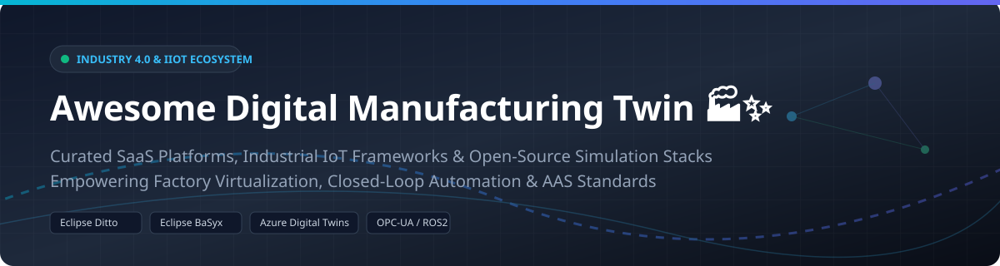

# Awesome Digital Manufacturing Twin 🏭✨



## 🚀 Top Digital Manufacturing Twin Ecosystem

<a href="https://github.com/ishandutta2007/Awesome-Awesome-Awesome"></a> <a href="https://discord.gg/jc4xtF58Ve"></a> [](https://awesome.re) [](https://opensource.org/licenses/MIT) [](https://en.wikipedia.org/wiki/Fourth_Industrial_Revolution) [](https://en.wikipedia.org/wiki/Digital_twin) <a href="https://github.com/ishandutta2007"></a>

> **Curated List of Enterprise SaaS Platforms & Open-Source GitHub Projects for Industrial Digital Twins, Production Simulation, Industrial IoT (IIoT), Shop-Floor Virtualization & Closed-Loop Smart Manufacturing.**

**Last updated: October 2026** 📅

---

## 📌 Table of Contents

- [🌐 SaaS / Enterprise Hosted Platforms](#-saas--enterprise-hosted-platforms)
- [🔓 Open-Source GitHub Projects](#-open-source-github-projects)
- [🧩 Architectural Stacks & Integration Patterns](#-architectural-stacks--integration-patterns)
- [🤝 How to Contribute](#-how-to-contribute)
- [⚠️ Disclaimer](#%EF%B8%8F-disclaimer)

---

## 🌐 SaaS / Enterprise Hosted Platforms

> **Market Analysis & Industry Overview:** 📊  
> The global Digital Twin market in manufacturing is estimated at **$15.8 Billion in 2026** (projected to reach **$110+ Billion by 2032** growing at a CAGR of ~35%). The market is **moderately fragmented**, dominated by tier-1 PLM, CAD, and Cloud infrastructure giants (Siemens, Dassault, Azure, PTC), while specialized simulation and niche AI platforms (C3 AI, Altair, Bentley) capture high-value operational segments.

*Platforms below are sorted by Company Revenue / Valuation (Descending).* 📈

| Platform | Market Size / Valuation 💰 | Description 📝 | Starting Pricing Tier 🏷️ | Free Tier / Trial Limits 🎁 |
| --- | --- | --- | --- | --- |
| **[Azure Digital Twins](https://azure.microsoft.com/en-us/products/digital-twins)** | **~$245 Billion** (Microsoft Annual Rev.) | Cloud PaaS graph service to build spatial intelligence models and live operational twin graphs. | $2.50 per 1M operations / $1.00 per 1M messages | $200 free credit for first 30 days via Azure Free Account |
| **[Siemens Xcelerator](https://www.siemens.com/xcelerator)** | **~$85 Billion** (Siemens AG Annual Rev.) | Enterprise PLM, automation, and industrial IoT platform for digital twin virtualization and plant operations. | $100/user/month (Siemens Xcelerator Academy / Cloud entry) | 30-day free trial (Siemens MindSphere / Insights Hub) |
| **[Dassault 3DEXPERIENCE](https://www.3ds.com/)** | **~$6.5 Billion** (Annual Rev.) | Spans design, 3D physics, manufacturing execution context, and live digital twins of products and plants. | $15/user/month (SolidWorks Cloud / Maker tier) | 30-day free trial (DraftSight & startup program) |
| **[AVEVA CONNECT](https://www.aveva.com/)** | **~$1.6 Billion** (Annual Rev.) | Industrial cloud platform offering data historians, asset performance management, and digital twin insights. | $1,200/year (AVEVA Flex base credits subscription) | 30-day free trial (AVEVA Connect preview sandbox) |
| **[PTC ThingWorx](https://www.ptc.com/en/products/thingworx)** | **~$2.1 Billion** (Annual Rev.) | Industrial IoT platform for device connectivity, asset monitoring, and shop-floor digital twins. | $200/user/month (ThingWorx Developer & Kepware entry tier) | 30-day free trial (ThingWorx Developer Portal access) |
| **[Ansys Twin Builder](https://www.ansys.com/products/digital-twin/ansys-twin-builder)** | **~$2.3 Billion** (Annual Rev.) | Simulation-centric twin tool for multi-physics models and real-time operational simulation. | $1,500/year (Ansys Discovery / Entry simulation license) | 30-day free trial (Evaluation license upon request) |
| **[Bentley iTwin](https://www.bentley.com/software/itwin-platform/)** | **~$1.2 Billion** (Annual Rev.) | Open infrastructure digital twin platform for plant engineering and asset lifecycle visualization. | $100/month (iTwin Developer platform consumption subscription) | $1,000 free usage credits for first 90 days (iTwin Developer Free Tier) |
| **[Altair Twin Activate](https://altair.com/twin-activate)** | **~$620 Million** (Annual Rev.) | Multi-domain system modeling and dynamic simulation for digital twin development. | $1,000/year (Altair Units base tier subscription) | 14-day free trial (Full student edition for academic email) |
| **[Unity Industry](https://unity.com/solutions/industry)** | **~$1.8 Billion** (Annual Rev.) | Real-time 3D platform for immersive factory visualization, digital twin simulation, and AR/VR. | $2,310/user/year (Unity Pro starting license) | 30-day free trial (Unity Industry 30-day evaluation) |
| **[C3 AI Digital Twin](https://c3.ai/)** | **~$310 Million** (Annual Rev.) | Enterprise AI application suite for predictive maintenance, supply chain, and asset twin analytics. | $0.55/vCPU-hour (C3 AI Studio consumption rate on AWS/Azure Marketplace) | 14-day free trial (C3 AI Studio trial environment) |

---

## 🔓 Open-Source GitHub Projects

> **Empowering Open Industry 4.0 Standardizations:** ⚡  
> Open-source manufacturing twins leverage **Asset Administration Shell (AAS)**, **OPC-UA**, **Eclipse IoT**, and **ROS 2** robotics stacks to ensure data ownership and eliminate vendor lock-in.

*Projects below are sorted by GitHub Star Count (Descending).* ⭐

1. **[ROS 2 (Robot Operating System)](https://github.com/ros2/ros2)**  
   [](https://github.com/ros2/ros2/stargazers)  
   *Open robotics middleware frequently used as the live control, kinematic, and simulation twin layer for flexible manufacturing cells.* 🤖

2. **[ThingsBoard](https://github.com/thingsboard/thingsboard)**  
   [](https://github.com/thingsboard/thingsboard/stargazers)  
   *Open-source IoT platform for data collection, processing, visualization, and digital twin device management.* 📊

3. **[Node-RED](https://github.com/node-red/node-red)**  
   [](https://github.com/node-red/node-red/stargazers)  
   *Low-code programming tool for wiring together industrial IoT hardware devices, APIs, and digital twin data flows.* 🔌

4. **[FIWARE Context Broker](https://github.com/FIWARE/context.Orion)**  
   [](https://github.com/FIWARE/context.Orion/stargazers)  
   *NGSI-based open context broker approach adapted for factory data fabrics and multi-source manufacturing twins.* 🌐

5. **[Eclipse Ditto](https://github.com/eclipse-ditto/ditto)**  
   [](https://github.com/eclipse-ditto/ditto/stargazers)  
   *Open digital twin framework for industrial IoT—API-centric state shadows of machines, sensors, and production lines.* 👥

6. **[Apache StreamPipes](https://github.com/apache/streampipes)**  
   [](https://github.com/apache/streampipes/stargazers)  
   *Self-service industrial IoT toolbox for stream analytics and operational dashboards feeding live factory twins.* 🌊

7. **[Eclipse BaSyx](https://github.com/eclipse-basyx/basyx-java-sdk)**  
   [](https://github.com/eclipse-basyx/basyx-java-sdk/stargazers)  
   *Open Industry 4.0 Asset Administration Shell (AAS) implementation—standardized digital representations of manufacturing assets.* 🏗️

8. **[OpenPLC Editor](https://github.com/thiagoralves/OpenPLC_Editor)**  
   [](https://github.com/thiagoralves/OpenPLC_Editor/stargazers)  
   *Open IEC 61131-3 programmable logic controller automation stack used to connect physical factory equipment to twin backends.* ⚙️

9. **[Open Factory Twin (OFacT)](https://github.com/openfactorytwin/ofact)**  
   [](https://github.com/openfactorytwin/ofact/stargazers)  
   *Open digital twin framework for production logistics, material flow state models, and closed-loop work instructions.* 📦

10. **[Salabim (Discrete-Event Simulation)](https://github.com/salabim/salabim)**  
    [](https://github.com/salabim/salabim/stargazers)  
    *Object-oriented Python discrete-event factory simulation package for offline manufacturing twin predictive modeling.* ⏱️

---

## 🧩 Architectural Stacks & Integration Patterns

```
  +-----------------------------------------------------------------------+
  |                        Physical Shop Floor                            |
  |   Sensors (IoT) | PLCs (OpenPLC) | CNCs | Industrial Robots (ROS 2)   |
  +-----------------------------------------------------------------------+
                                      |
                                  (OPC-UA / MQTT)
                                      v
  +-----------------------------------------------------------------------+
  |                     Digital Twin Ingestion & Context                  |
  |      Eclipse Ditto (State Shadows) + Eclipse BaSyx (AAS Models)       |
  +-----------------------------------------------------------------------+
                                      |
                            (Analytics & Simulation)
                                      v
  +-----------------------------------------------------------------------+
  |                     Visualization & Optimization                      |
  |     Grafana Dashboards | 3D/Physics Sims (Ansys/Unity) | AI Models     |
  +-----------------------------------------------------------------------+
```

- **Twin State Shadowing**: Eclipse Ditto for machine-level APIs.
- **Industrie 4.0 Compliance**: Eclipse BaSyx Asset Administration Shell (AAS).
- **Logistics & Robotics**: ROS 2 + Open Factory Twin for autonomous material handling.
- **Data Fabric Pipeline**: OpenPLC / OPC-UA → Node-RED / StreamPipes → Time Series DB → 3D Simulation.

---

## 🤝 How to Contribute

Contributions are welcome! Please follow these simple guidelines: 📑

1. Fork this repository. 🍴
2. Add/edit entries in `README.md` following the table or list formatting. ✍️
3. Ensure descriptions are concise, factual, and include links to official sources. 🔗
4. Submit a Pull Request (PR) with a brief summary of additions. 🚀

---

## ⚠️ Disclaimer

- This repository contains a **community-curated** overview intended for informational and educational purposes.
- Deploying digital twins that execute live closed-loop commands back to factory machinery requires strict OT cybersecurity, fail-safe mechanisms, and regulatory validation.
- Commercial platforms provide deep out-of-the-box CAD/PLM integration, while open-source projects maximize data sovereignty and standards compliance.

---

## 💖 Support & Community

Thank you for visiting and using this repository! If you find this curated list of Digital Twin platforms and Industry 4.0 frameworks helpful:

- ⭐ **Star this repository** to help others discover it!
- 🍴 **Fork it** to contribute new open-source projects or SaaS products.
- 📢 **Share it** with fellow industrial engineers, IT/OT teams, and digitalization leaders!
- ☕ **Buy me a coffee / Sponsor**: If you'd like to support the maintenance of this list, consider sponsoring via the [GitHub Sponsor Dashboard](https://github.com/sponsors/ishandutta2007).

<a href="https://github.com/sponsors/ishandutta2007"></a>

---

**Made with ❤️ for Manufacturing IT/OT Teams, Industrial Engineers & Industry 4.0 Innovators.** 🛠️

---

## 📈 Star History
[](https://star-history.dera.page/#ishandutta2007/Awesome-Digital-Manufacturing-Twin&type=date&legend=top-left)

